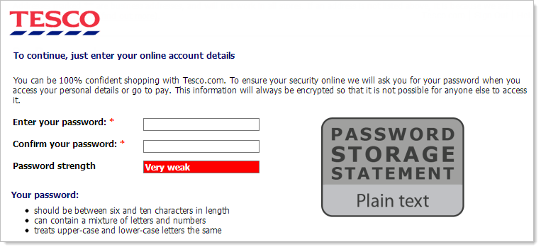

We are regularly asked when registering for a website to make sure that we use a secure password, over a certain number of characters, different character sets etc. but once we have submitted our password how do we know that their password storage strategy is adequate?

Yesterday I realised that I had forgotten my password for a web hosting service that I use, so I went to the ‘Forgot my password’ and entered my email address. What I received upset me, they had not sent me the standard reset my password email, they sent me an email containing my username and password!

<figcaption class="wp-caption-text" id="caption-attachment-16">The ‘Forgot my password’ email from a hosting company, showing their poor password storage strategy</figcaption></figure>

This tells me instantly that their password storage strategy is flawed, they should not be able to retrieve the plain text version of my password. You would have hoped with the number of large websites which have had their user details stolen that companies would have realised that they need a decent password storage policy. Some great examples of where the password storage strategy has not been adequate are [Tesco](http://www.theregister.co.uk/2012/07/31/tesco_website_insecurity/ "TheRegister - Tesco Web Insecurity"), [Gawker](http://www.bbc.co.uk/news/technology-11998648 "BBC News - Gawker hack triggers password resets at major sites"), [ABC](http://www.mailguard.com.au/blog/hashed-abc-passwords-cracked-by-australian-security-researcher/ "Mailguard.com.au - “Hashed” ABC Passwords Cracked by Australian Security Researcher") and of course [Sony](http://www.zdnet.com/article/sony-hacked-again-another-1m-passwords-exposed/ "Sony Hacked Again, 1 Million Passwords Exposed").

### Public disclosure of password storage strategy

Troy Hunt recently voiced [his views](http://www.troyhunt.com/2013/03/should-websites-be-required-to-publicly.html "Should websites be required to publicly disclose their password storage strategy?") on how this problem could be dealt with, his suggestion being to bring in legislation similar to the [EU’s Cookie Law](http://www.cookielaw.org/ "EU Cookie Law - Audit, Analytics, Cookie Compliance"), which would require that websites that store users passwords have their password storage strategy prominently displayed on their registration page. While it wouldn’t necessarily mean that all websites that would stop storing their users’ passwords stored plain text, it would be much less common. How many organisations do you think of that would be happy with their registration page looking like this?

A mock-up of Tesco online’s registration page displaying their password storage statement. This image belongs to Troy Hunt (http://www.troyhunt.com/2013/03/should-websites-be-required-to-publicly.html)

I feel that this is a great suggestion and if it was brought into legislation that it was required for websites then it would help to convince most of the plain text offenders to switch from having the passwords stored plain text to uniquely salted hashes.

### Limitations of enforcing password storage statements

While I feel that getting websites to tell us of their password storage strategy is definitely a step in the right direction, there are a few details which may need to be looked into. How to display the information in a way that the average Joe can understand whether their password is stored safely and how to make sure that the password storage strategy is adequate years after its implementation?

When implementing password storage there are three common techniques for this, plain text, encryption and hashing. Plain text is obviously not an option that we would like to have used as our passwords can be read without any problem. Encryption while slightly more secure still means that it is possible to retrieve the plain text, if a malicious hacker managed to get access to the website then they could get both the encrypted password and the key that was used to encrypt it. The last option of hashing is the only acceptable way of storing passwords as this is a one-way process even then ideally we would like to salt the password for extra security. So if we were to give a random member of the public the choice between having their password stored using Triple DES or MD5, they would be unlikely to be able to explain which is more appropriate.

MD5 and SHA1 are examples of hashing algorithms, they are one-way processes for securing passwords so we can not directly get their plain text back. The problem with this is that both MD5 and SHA1 are considered to be insecure and not to be used for applications anymore, but when they first came out they were both considered to be secure and actively promoted as an appropriate way of storing passwords. What can we tell by this? That what we are using now may not be considered secure in five years time.

### What can we do to address these limitations?

Whether we look at the nutritional information on food packaging, traffic lights or laptop battery lights, we often see a red, yellow or green indication saying whether or not what we are doing is safe/a good idea. By having the password storage statement use the same system it would aid in allowing the user to not have to understand the details but have an idea whether their password will be held securely.

The problem of password storage methods becoming insecure with time is a more complex issue, this is because we would want to keep the entry-level for putting an average Joe understandable password storage statement on the website to a minimum. The best solution that I could come up with was that it would be possible to make a centralised web service that would supply the password storage statement. The website could register providing the details of their password storage strategy and be provided with the URL for their custom password storage statement image, which could be used on the website.

### But is it really worth it?

While I have covered a couple of potential issues that I see with Troy Hunt’s suggestion, I feel that addressing these are less important than actually getting organisations to think about their password storage strategy and to have some accountability. By having a simple password storage statement on their registration page similar to the one suggested by Troy Hunt, this would force organisations to address existing poor practice and hopefully make the storage of our passwords more secure.

Do you feel that Troy Hunt’s suggestion of having companies required to publicly show their password storage strategy would help to make sure that companies store your login credentials for their websites in a secure fashion?